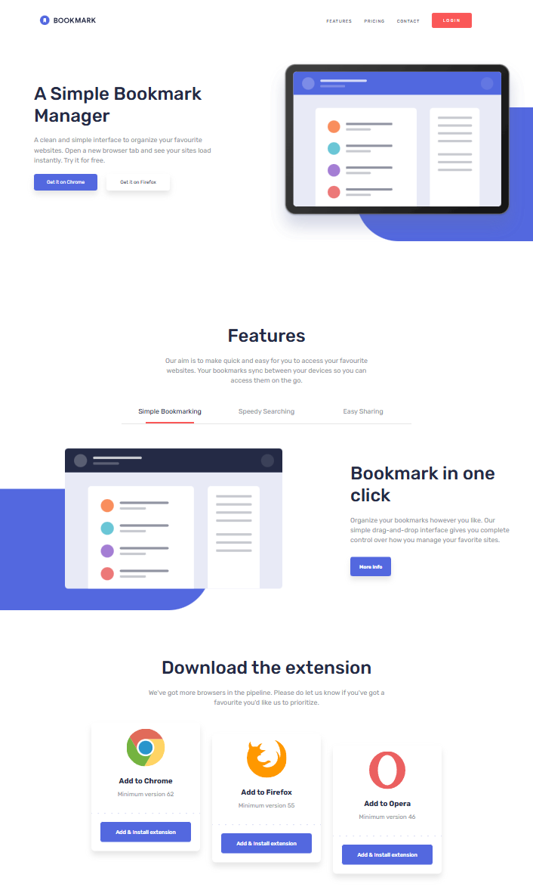

# tailwind-implementation

[](https://github.com/RichardLitt/standard-readme)
<!-- TODO: Add more badges here (e.g. license, build, etc.) -->

**Bookmark landing page** built with **TAILWIND**, designed with a **responsive** and **mobile-first** approach.

---

## Table of Contents

- [Background](#background)
- [Technologies](#technologies)
- [Structure](#structure)
- [Installation](#installation)
- [Available Scripts](#available)
- [Screenshots](#screenshots)
- [Maintainers](#maintainers)
- [Contributing](#contributing)
- [License](#license)

---

## Background

This project started as a web layout practice with the goal of recreating a **modern landing page** using TAILWIND.  
It focuses on learning **semantic structure**, **Flexbox**, **CSS Grid**, and **responsiveness** across different screen sizes without relying on additional frameworks.

---

## Technologies

- HTML5  
- TailWind 4.1.17
- JavaScript
- Vite v7.2.1
- Node v25.1.0


---

## Structure

``` text
├── assets/             # Images, icons, and other static assets
├── dist/               # Production build output (generated automatically)
├── node_modules/       # Installed npm dependencies
├── public/             # Public files
├── src/                # Main source code
│ ├── counter.js        # Example JavaScript module
│ ├── javascript.svg    # SVG resource used in the project
│ ├── main.js           # Main entry point of the application
│ └── style.css         # Main stylesheet
├── .gitignore          # Git ignore configuration
├── index.html          # Main HTML file
├── package.json        # Project metadata, scripts, and dependencies
├── package-lock.json   # Locked dependency versions
├── readme.md           # Project documentation
└── vite.config.js      # Vite configuration 
```

---

## Installation
```text
# Clone the repository
git clone https://github.com/isaacmg-bit/bookmark-vanilla-implementation.git

# Navigate to the project folder
cd bookmark-vanilla-implementation

# Install dependencies
npm install

# Install Tailwind
npm install tailwindcss @tailwindcss/vite

# Start the local server
npm run dev

# The project should be accessible at:
# http://localhost:5173/
```

---

### Available Scripts
```text
npm run dev   # Launches the development server
npm run build # Builds the project for production in the dist/ folder
```

---

---

## Screenshots

### Desktop
, (./assets/img/screenshots/desktopscreen2.png)

### Mobile
, (./assets/img/screenshots/mobilescreen2.png), (./assets/img/screenshots/mobilescreen3.png), (./assets/img/screenshots/mobilescreen4.png), (./assets/img/screenshots/mobilescreen5.png)

---

## Maintainers

[@Isaac Malagón](https://github.com/isaacmg-bit)

---

## Contributing
```text
1. Fork this repository
2. Create a new branch (`git checkout -b feature/your-feature`)
3. Make your changes and commit (`git commit -m 'Add new feature'`)
4. Push to your branch (`git push origin feature/your-feature`)
5. Create a Pull Request
```
**Pull requests** are welcome.  
If you edit the README, please make sure to follow the  
[standard-readme](https://github.com/RichardLitt/standard-readme) specification.

---

## License

This work is licensed under a [Creative Commons Attribution-NonCommercial 4.0 International License](https://creativecommons.org/licenses/by-nc/4.0/).  
© 2025 Isaac Malagón — Commercial use and redistribution are not allowed without permission.
